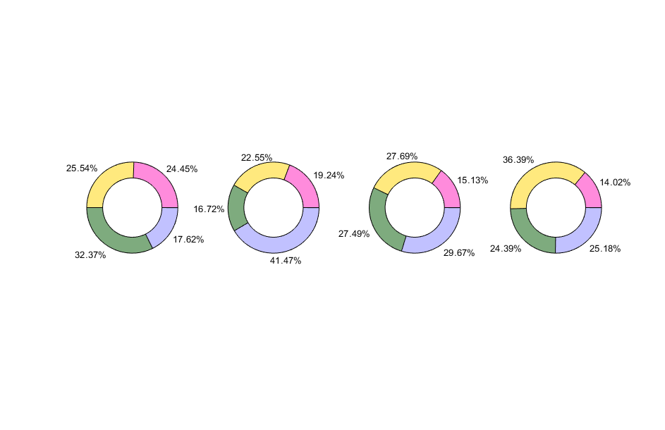
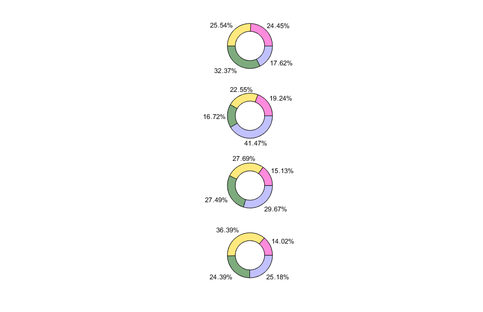
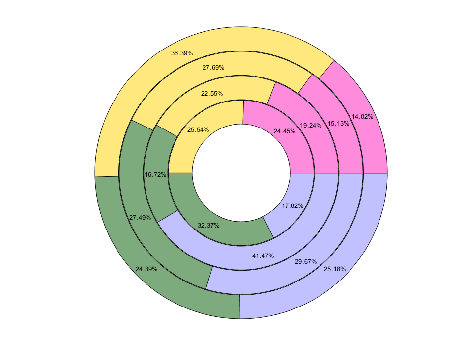
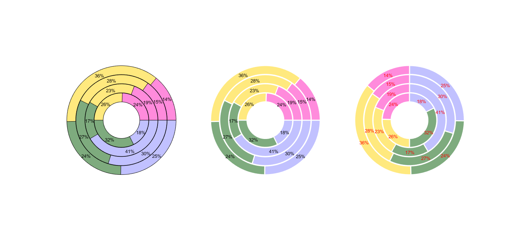
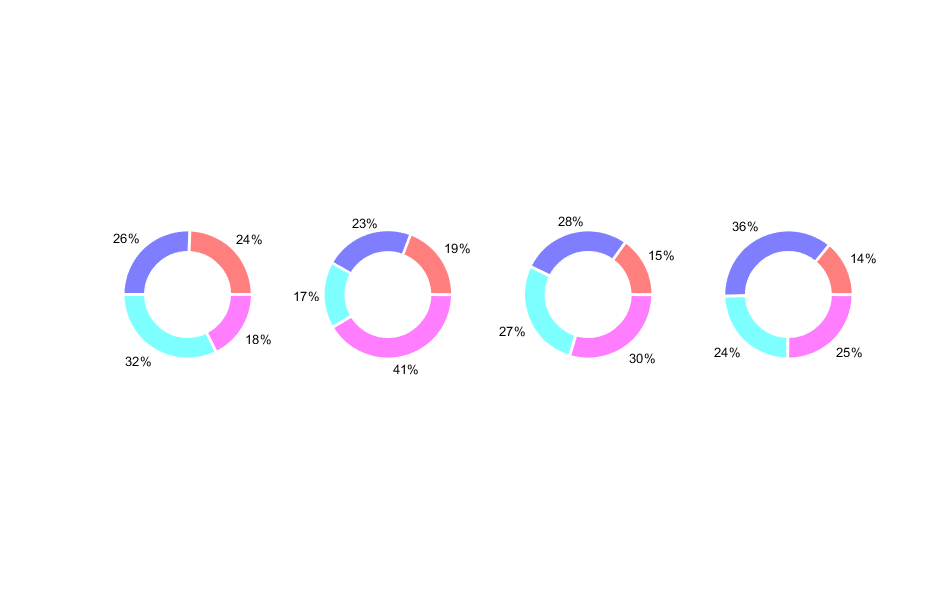
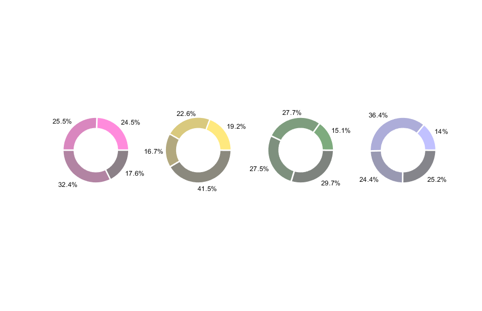
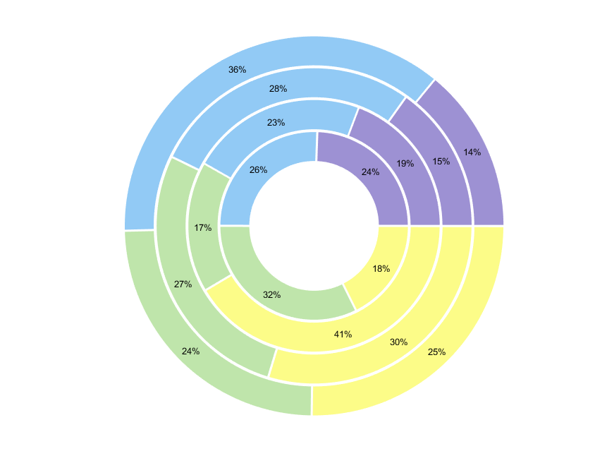
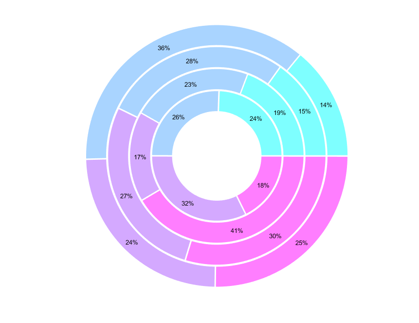
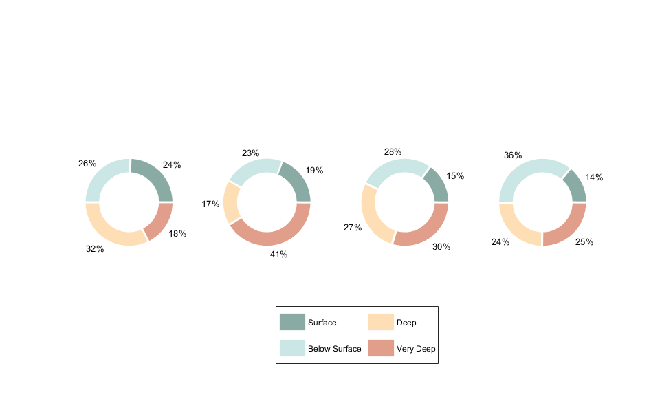
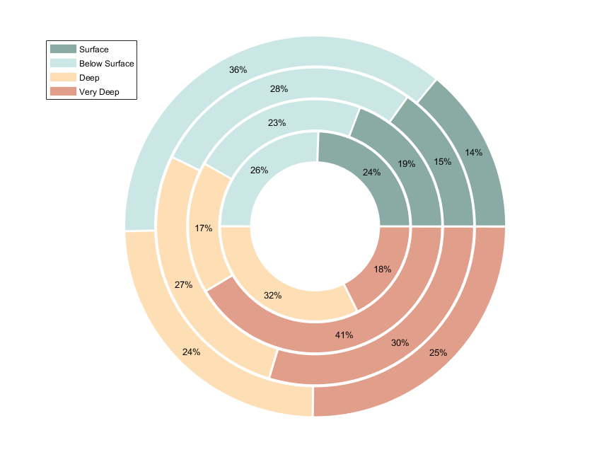

[](https://zenodo.org/doi/10.5281/zenodo.10460350) 
[](https://www.mathworks.com/matlabcentral/fileexchange/157171-circpercent)
[](https://matlab.mathworks.com/open/github/v1?repo=cgallimore25/circPercent&file=README.md)

# donutPlot
Use circular arcs to graphically illustrate proportions and percentages in MATLAB. 
For a fully comprehensive demo of usage, special case handling, and the latest features, checkout the demo file `donutPlot_demo.mlx`.

This function was designed to allow more complicated inputs and user control over the native `'pie.m'` function, while producing arcs in exactly the same way as `pie()` wedges in its handling of uncommon cases. 
It further expands `pie()` by supporting matrix input, direct specification of `'facecolor'`, and compatibility with `colormap()` calls. 
With exception of categorical data treatment, it also builds upon MATLAB's 2023 introduction of `donutchart()` by allowing most of the same essential features and more. 
One example is a `'concentric'` plotting style embedding multiple groups in a single donut, control over ring separation with this style, and addition of a custom radial legend to indicate group membership. 

Catalog of changes in version `2.0.1` (formerly 'circPercent'):
- Converted plotted elements from line to patch objects for both fill and edge customization
- Support for concentric plotting style, embedding data series inside-out
- New name, value pairs for user-defined start angle, donut radius, transparency, linewidth, and text color
- Transitioned to an input parser object for flexible argument handling
- Modularization of coordinate calculations, special cases, and directional control
- Added ring separation parameter for user control of visible spacing (specific to `'concentric'` style)
- Support for a radial legend indicating groups (specific to `'concentric'` style)


## Syntax:
`donutPlot(data)`

`donutPlot(data, Name, Value, ...)`

`h = donutPlot(_)`

## Input Arguments:
*(Required)*

- **data** - A scalar, vector, or matrix of proportions/percentages. The rows are assumed to be groups, or 'series' of data, and the columns are the components to the total.
             [scalar | vector | matrix]

## Output Arguments:
*(Optional)*
- **h**                - Figure handle of donut plot (arc patches, text, colors).
                         [structure]

## Name-Value Pair Arguments:
*(Optional; case insensitive)*

-**'faceColor'**   - an m x 3 vector or matrix specifying RGB triplet(s), or a 1 x m array assigning face color values directly (e.g. `1:m`).
                     [m x 3 vector | matrix]

-**'edgeColor'**   - same as `'facecolor'`, but only specify one that will be applied to all patch edges (e.g. `'w'`, or `'k'`).
                     [RGB triplet | char]

-**'textColor'**   - same as `'edgecolor'`
                     [RGB triplet | char]

-**'faceAlpha'**   - scalar in range [0, 1] specifying opacity.

-**'lineWidth'**   - a positive scalar value in points (1 pt = 1/72 inches).

-**'orientation'** - `'horizontal'`, `'vertical'`, or `'concentric'`; this argument only exerts effects for more than 1 data series, determining whether they are plotted from 
                     left-to-right, top-to-bottom, or 'inside-to-outside', respectively. One letter shorthand forms are available for each.
                     [`'horizontal'` | `'vertical'` | `'concentric'` | `'h'` | `'v'` | `'c'`]

-**'precision'**   - specifies the rounding precision for text labels (i.e. the max number of decimal places to keep)
                     [`0` | `1` | ... `n` | non-negative scalar]

-**'innerRadius'** - scalar in range [0, 1] specifying the inner radius of patches as a proportion of the outer radius. A value of '0' creates a pie chart; a value of '1' creates a ring with no visible slices 
                     [`0.65` (default) | scalar]

-**'outerRadius'** - a non-negative scalar specifying outer patch radius. Most applicable for `'horizontal'` or `'vertical'` orientations, whereas `'concentric'` defaults to ring widths of radius 1 and this argument is ignored.

-**'startAngle'**  - scalar value in degrees specifying start angle where patches emanate. `0` corresponds to 3 o'oclock. Positive values rotate counterclockwise, negative values clockwise.
                     [`0` (default) | scalar]

-**'direction'**   - specifies direction patches step from `'startAngle'`.
                     [`'clockwise'`, `'cw'`, | `'counter-clockwise'`, `'ccw'` (default)]

-**'scheme'**      - `'category'` or `'series'`, determines the coloring scheme. In one case, your 'color' matrix may represent the color you want each common 'category' to be for all series (default). 
                     In another case, you may be specifying the base color you want your percentage components to be for each 'series'. In this option, subsequent percentages will be plotted darker.
                     [`'category'` | `'series'`]

-**'patchRes'**    - a positive scalar value specifying the number of points used to represent the largest arc. Subsequent (smaller) arcs are represented in proportion to this.
                     [`300` (default) | positive scalar]

-**'showLabels'**  - permits suppression of overlaying value labels when set to false. 
                     [`true` (default) | `false` | `0` | `1`]

-**showLegend**    - specific to the `'concentric'` plotting orientation, followed by a string array of legend labels equal to n groups.
                     [string array]


## Examples

### Example 1: Minimum working example

```matlab
% Create some data
data= [0.2445	0.2554	0.3237	0.1762;
       0.1924	0.2255	0.1672	0.4147;
       0.1513	0.2769	0.2749	0.2967;
       0.1402	0.3639	0.2439	0.2518]; 

total= sum(data, 2);  % show groups are rows and components are cols

% Create plot
figure;
donutPlot(data);
```
<p align="center">
  
</p>

Notice that the function implicitly assumes that groups are distributed along the rows. You can achieve the equivalent output in this example using:
```matlab
% Create plot
figure;
donutPlot(data, 2);
```
or '1' if your input data is transposed (column = group, rows = components).

### Example 2: Orientation customization

```matlab
data= [0.2445	0.2554	0.3237	0.1762;
       0.1924	0.2255	0.1672	0.4147;
       0.1513	0.2769	0.2749	0.2967;
       0.1402	0.3639	0.2439	0.2518]; 

figure;
donutPlot(data, 2, 'orientation', 'vertical');
```
<p align="center">
  
</p>

```matlab
data= [0.2445	0.2554	0.3237	0.1762;
       0.1924	0.2255	0.1672	0.4147;
       0.1513	0.2769	0.2749	0.2967;
       0.1402	0.3639	0.2439	0.2518]; 

figure;
donutPlot(data, 2, 'orientation', 'concentric');
```
<p align="center">
  
</p>

All of these options support a shorthand specification as well by using 'h', 'v', or 'c' for the corresponding above inputs. 

### Example 3: Altering the inner radius

The `'innerRadius'` Name,Value pair specifies the inner radius of the donut as a proportion of the outer radius. This means you can plot a simple pie chart with input '0', and invisible rings with input '1'. I do this in a loop because the function currently only supports a scalar, common radius applied to all groups in the case of matrix input. Plot one subject's data for simplicity.

```matlab
data= [0.2445	0.2554	0.3237	0.1762;
       0.1924	0.2255	0.1672	0.4147;
       0.1513	0.2769	0.2749	0.2967;
       0.1402	0.3639	0.2439	0.2518];
 
n_subj= size(data, 1);  % make variable for n groups / subjects

r= 0.9:-0.3:0; 

figure;  
for s= 1:n_subj
    subplot(1, n_subj, s)
    donutPlot(data(4, :), 'innerRadius', r(s));
end
```
<p align="center">
  
</p>

### Example 4: Start angle & text precision customization

The `'startAngle'` Name,Value pair allows specification of the position where all patches for the first component emanate, corresponding to the unit circle (default '0' is 3 o'clock; '90' is midnight). Positive angles step counter-clockwise, whereas negative angles will step clockwise. 

We'll add on the `'precision'` pair here too to clean up the text a bit. 

```matlab
data= [0.2445	0.2554	0.3237	0.1762;
       0.1924	0.2255	0.1672	0.4147;
       0.1513	0.2769	0.2749	0.2967;
       0.1402	0.3639	0.2439	0.2518];

figure;  
subplot(1, 2, 1)
donutPlot(data, 2, 'orientation', 'c', 'precision', 1);
subplot(1, 2, 2)
donutPlot(data, 2, 'startangle', 90, 'orientation', 'c', 'precision', 0);
```
<p align="center">
  
</p>

### Example 5: Line and color specification

Conforms to the same specs used by default in MATLAB for `'edgeColor'`, `'lineWidth'`, `'textColor'`. I introduce these separately from `'faceColor'` (below) because these 3 apply input to all patch or text elements, whereas `'faceColor'` can receive a 1-to-1 mapping for all patch element faces (i.e. vector or matrix input).

```matlab
data= [0.2445	0.2554	0.3237	0.1762;
       0.1924	0.2255	0.1672	0.4147;
       0.1513	0.2769	0.2749	0.2967;
       0.1402	0.3639	0.2439	0.2518];

figure;  
subplot(1, 3, 1)
donutPlot(data, 2, 'orientation', 'c', 'precision', 0);
subplot(1, 3, 2)
donutPlot(data, 2, 'orientation', 'c', 'edgecolor', 'w', 'linewidth', 2, 'precision', 0);
subplot(1, 3, 3)
donutPlot(data, 2, 'orientation', 'c', 'edgecolor', [1 1 1], 'linewidth', 2, 'textcolor', 'r', 'startangle', 90, 'precision', 0);
```
<p align="center">
  
</p>

### Example 6: Facecolor customization

This function utilizes `distinguishable_colors.m` ([File exchange](https://www.mathworks.com/matlabcentral/fileexchange/29702-generate-maximally-perceptually-distinct-colors)) to create colors for you, though you are free to pass your own custom color arguments in using 'facecolor' followed by an m x 3 array input, where m == size(data, 1).

```matlab
data= [0.2445	0.2554	0.3237	0.1762;
       0.1924	0.2255	0.1672	0.4147;
       0.1513	0.2769	0.2749	0.2967;
       0.1402	0.3639	0.2439	0.2518];

simple_colrs= [1 0 0;
              0 0 1;
              0 1 1;
              1 0 1];

figure;
donutPlot(data, 2, 'facecolor', simple_colrs, 'precision', 0, 'edgecolor', 'w', 'linewidth', 2);
```
<p align="center">
  
</p>

### Example 7: Color scheme

By default, the colors are assigned to the categories (i.e. the various components making up the totals for each group). However, you can alter the color scheme to assign the different colors to each data series, which darkens the custom input (or default) colors for the subsequent components.

```matlab
data= [0.2445	0.2554	0.3237	0.1762;
       0.1924	0.2255	0.1672	0.4147;
       0.1513	0.2769	0.2749	0.2967;
       0.1402	0.3639	0.2439	0.2518];

figure;
donutPlot(data, 2, 'scheme', 'series', 'precision', 1, 'edgecolor', 'w', 'linewidth', 2);
```
<p align="center">
  
</p>

### Example 8: Usage with colormap() call

Version `2.0.0` uses `'FaceVertexCData'` to alter patch color, meaning it can also directly be assigned a value for usage with default colormaps.

```matlab
data= [0.2445	0.2554	0.3237	0.1762;
       0.1924	0.2255	0.1672	0.4147;
       0.1513	0.2769	0.2749	0.2967;
       0.1402	0.3639	0.2439	0.2518];

figure;
donutPlot(data, 2, 'orientation', 'c', 'facecolor', 1:4, 'edgecolor', 'w', 'linewidth', 2, 'precision', 0);
```
<p align="center">
  
</p>

```matlab
figure;
donutPlot(data, 2, 'orientation', 'c', 'facecolor', 1:4, 'edgecolor', 'w', 'linewidth', 2, 'precision', 0);
colormap(cool)
```
<p align="center">
  
</p>

In the demo `.mlx` file, I detail some additional examples of how you could use 4 different colormaps all in the same figure (1 for each subplot). 

### Example 9: Recommended usage with legend()

A basic, empty `'legend()'` call will produce an unwieldy display of all patches which redundantly repeat the same colors used across all series.  We can truncate this by editing our legend call to ignore remaining entries (by passing an empty string) and only plot those common to multiple data series. Anyone who's used a legend in MATLAB with `'pie.m'` knows that its default location will likely obscure the data.  We can use the `'Position'` property to achieve a cleaner look. 

**NOTE:** This custom colormap is included as a local function in the `.mlx` demo file.

```matlab
data= [0.2445	0.2554	0.3237	0.1762;
       0.1924	0.2255	0.1672	0.4147;
       0.1513	0.2769	0.2749	0.2967;
       0.1402	0.3639	0.2439	0.2518];

lgd_pad= strings(1, numel(data) - size(data, 2) );   % array of empty strings to pad
lgd_txt= ["Surface", "Below Surface", "Deep", "Very Deep", lgd_pad];

figure;
donutPlot(data, 2, 'facecolor', 1:4, 'edgecolor', 'w', 'linewidth', 2, 'precision', 0);
colormap(owt)
legend(lgd_txt, "NumColumns", 2, "Position", [0.5 0.1 0.1 0.2])
```
<p align="center">
  
</p>

```matlab
figure;
donutPlot(data, 2, 'orientation', 'c', 'facecolor', 1:4, 'edgecolor', 'w', 'linewidth', 2, 'precision', 0);
colormap(owt)
legend(lgd_txt, "Position", [0.1 0.75 0.1 0.2])
```
<p align="center">
  
</p>
